<div align="center">
  

  
  <br/>


  
  </br>
  </br>
  
  
</div>

## About Me

```javascript
const adil = {
    location: "Building in the Cloud ☁️",
    currentFocus: ["Backend Development", "Blockchain Development"],
    currentlyLearning: "Advanced System Architecture",
    funFact: "in the end console.log is the only option! 😉"
    coffee: "∞ cups/day"
};
```
</br>

## GitHub Stats

<div align="center">
  

   

  

  </br>
  
</div>

</br>

## Current Projects & Goals

```mermaid
graph LR
    A[🎯 2025 Goals] --> B[Master Web3 Development]
    A --> C[Contribute to Open Source]
    A --> E[Learn System Design]
    
    B --> F[Smart Contracts]
    B --> G[DeFi Protocols]
    
    C --> J[SDKs]
    C --> K[Developer Tools]
```

<div align="center">



</div>

## Socials

<div align="center">

[](https://www.instagram.com/adilhusain__?igsh=Z2h3enYzem54aThw) [](https://www.linkedin.com/in/adil-husain/) [](https://x.com/0xAdilHusain) [](https://t.me/adil_husain0) [](mailto:husainadil202@gmail.com) [](https://adilhusain.netlify.app)

</div>

##  Languages

<div align="center">
  
</div>

##  Tools

<div align="center">
  
  
  </br>
  
  
  </br>
  
  </br>

  
</div>

## IDE

<p align="center">
  
  
</p>

## OS

<div align="center">
  

  </br>
  
</div>

## Ahh and some brainrot


<div align="center">
  
  
  

  </br>
  **Star repositories if you find them interesting!**
  </br>
  </br>

  

</div>